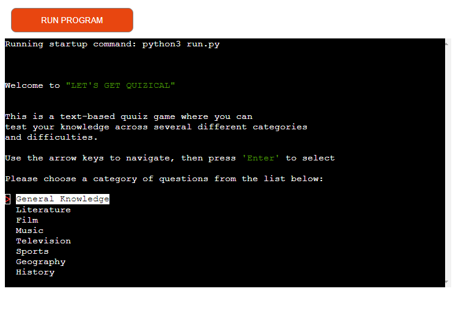
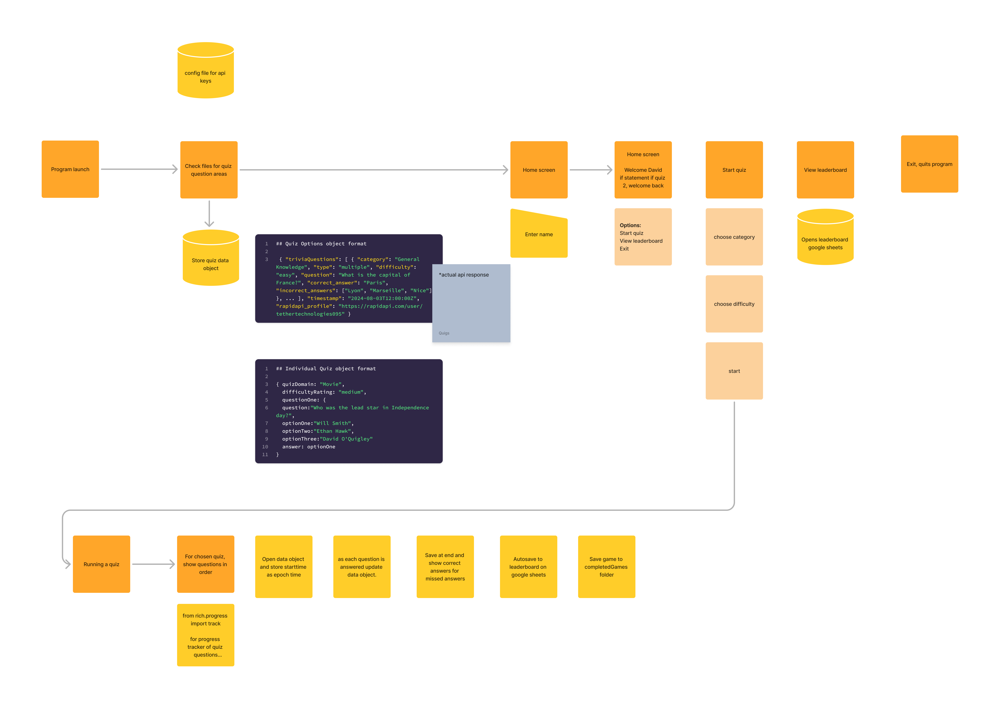

# Let's Get Quizzical

Welcome to Let's Get Quizzical, a text-based quiz game where you can
test your knowledge across several different categories and difficulties.

Visit the deployed site [here.](https://lets-get-quizzical-b0686c607658.herokuapp.com/)

---

## Contents

1. [Project Idea](#Project-Idea)
	* [Goals](#Goals) 
	* [Target Audience](#Target-Audience)
2. [Design](#Design)
    * [User Stories](#User-Stories)
    * [Logic](#Logic)
2. [Features](#Features)
    * [Existing Features](#Existing-Features)
    * [Future Features](#Future-Features)
3.  [Resources](#Resources)
    * [Technologies Used](#Technologies-Used)
    * [Libraries](#Libraries)
4. [Testing](#Testing)
	* [Validation](#Validation)
    * [Unit Testing](#Unit-Testing)
5. [Deployment](#Deployment)
6. [Credits](#Credits)

# Project Idea
"Let's Get Quizzical" is an interactive, text-based quiz game designed for the command-line interface (CLI). Perfect for developers, coding enthusiasts, or anyone who enjoys challenging their knowledge in various subjects, this game brings a sleek and efficient quizzing experience right to your terminal.

The gameplay is simple: players are presented with multiple-choice questions, and they must input their answer by navigating through the presented menu options. The game features different difficulty levels, customizable quiz categories (like general knowledge, science, history, tech).

One of the standout features of "Let's Get Quizzica" is its user-friendly navigation, which makes it easy to select categories and difficulty levels. The game keeps track of your score and progress, offering unique feedback after each round.

Whether you’re looking to sharpen your knowledge, take a break from coding, or just have some fun while learning, "Let's Get Quizzica" provides a fast-paced, distraction-free gaming experience that’s as educational as it is entertaining. Perfect for quick sessions or prolonged battles of wits!

## Goals
The primary goal of the "Let's Get Quizzical" project is to create an engaging and intuitive quiz game while leveraging web APIs to provide dynamic, up-to-date content. By interacting with web APIs, the game can pull fresh quiz questions from various categories, ranging from general knowledge to niche topics, ensuring that the user has access to an ever-evolving set of challenges. This integration adds depth and variety to the game, offering a richer experience beyond static, pre-defined questions.

Another key objective is to make the game both entertaining and user-friendly, even in a command-line interface. The minimalist design focuses on smooth navigation, instant feedback, and a responsive scoring system, allowing players to easily manage game modes, categories, and difficulty levels. By combining the interactive capabilities of web APIs with an accessible and fun interface, the project aims to deliver a quiz experience that feels fresh, engaging, and enjoyable for a wide range of users.

## Target-Audience
"Let's Get Quizzical" is designed for a broad audience, particularly targeting developers, tech enthusiasts, and command-line users who enjoy learning while playing. It appeals to individuals who spend time in terminal environments and are looking for a fun, intellectually stimulating break from coding or other command-line tasks.

The game also caters to trivia lovers who prefer a streamlined, text-based experience without the distraction of flashy graphics. Its focus on offering customizable quizzes—ranging from general knowledge to specific technical categories—makes it ideal for lifelong learners, students, and professionals looking to test or expand their knowledge.

In addition, the competitiveness make it suitable for collaborative environments, such as coding bootcamps or office settings, where teams can challenge each other. Overall, the game’s simplicity, flexibility, and broad question categories make it accessible to both casual players and trivia enthusiasts alike.

# Design
## User Stories
As a software developer, Alex spends most of the day working in the terminal. During a break, Alex launches "Let's Get Quizzical" to unwind while sharpening general knowledge. After selecting the "Science" category and medium difficulty, the game presents a series of multiple-choice questions. Alex enjoys the challenge of answering quickly, appreciating the immediate feedback and score updates. After finishing the round, Alex views the score and feels motivated to improve next time for a fun yet educational break!

## Logic
<!--  -->
1. The program starts, the user is greeted with a welcome a message explaining the concept of the game and how to navigate the input menus. They are presented with their first choice; choosing a game category. That gets stored in a global variable to be used in the API request
2. Next, the user is asked to select a difficulty level for their chosen category. This is also stored globally.
3. The API takes 3 parameters, one of which is constant; the number of questions which in this game is 10. The other two parameters have now been selected by the user so they can be plugged into the the `get_questions()` function. This ususlly takes a second, a message keeping the user informed is displayed.
The `get_questions()` receives a .json file which then get's converted to a dictionary where it is also removed of any unwanted data items.
4. After that `display_questions()` runs and is passed the list of questions from `get_questions()` where it iterates over each individual question via a `for` loop. Here, crucially, the questions, answer and incorrect answers are read from the dictionary and stored in local variables to be displayed in turn. Before they are displayed, they are passed through `format_data()` which removes any trailing and leading white space as well as unescapes any special characters.
5. Still within `display_questions()`, we get the correct answer and append it to the list of incorrect answers. We then use some `if` statements to determine if the answers are true/false or have 4 multiple choices. In the case that the latter is true, the answer list is shuffled. In the case of true or false answers, the list is ordered reverse alphabetically, providing a cosistant and intuitive way to display boolean answers.
6. The next function called from within `display_questions()` is the `display_answer_options()` function which which returns the users input to be checked against the correct answer in another function called `check_answer()`.
7. `check_answer()` as the name suggests, checks the answer, incrementing the score with either a 'correct' or 'Sorry, that's not right', providing feedback to the user.
8. The `display_questions()` function loops until all 10 questions have been played at which point it evokes `round_over()`. Here we use `match case` to compare the score to display an appropriate message then offer the user some options to replay the same round, a new category or exit the application via `replay_menu()`.

# Features

## Existing Features
"Let's Get Quizzical" boasts several features designed to enhance the gameplay experience and keep players engaged.

The keyboard navigable interface is at the heart of the game’s intuitive design. Players can easily interact with the game using simple keyboard inputs to select answers, navigate menus, or switch between categories and difficulty levels. This allows for a fast and efficient experience, eliminating the need for mouse input or complex commands.

Category selection adds variety, giving users the ability to choose topics that match their interests. Whether it’s science, history, music, or general knowledge, players can focus on their favorite subjects or explore new areas.

Similarly, difficulty selection offers flexibility, with options ranging from easy to hard, making the game suitable for all skill levels. Beginners can ease into the quiz, while trivia experts can challenge themselves with tougher questions.

Score keeping is another key feature, tracking performance across multiple rounds. Players receive real-time updates after each question, and the game maintains a cumulative score to track progress over time.

Finally, the game’s replayability keeps users coming back. With a vast question pool, multiple categories, and adjustable difficulty levels, every game session feels fresh, offering an endless cycle of learning and fun.

## Future Features
Future updates for "Let's Get Quizical" aim to enhance competitiveness and user engagement. One of the primary planned features is an online leaderboard, where players can compare their scores with others globally, adding a social and competitive element. Additionally, customizable user profiles will allow players to track their progress, save high scores, and personalize their gaming experience. Integration of daily challenges or themed quizzes will provide users with new, timed challenges to keep the gameplay dynamic. Lastly, expanding multiplayer functionality, allowing players to challenge friends or compete in real-time, will further enrich the interactive experience.

# Resources
## Technologies Used
* Python. This was the exclusive language used to code this project.
* Gitpod. This project was developed in Gitpod online IDE using CodeInstitutes Python Template
* Github. Used for version control and backup
* Heroku. Used to host the completed project.
* Rapidapi. The site where the 'trivia-questions-api' is hosted.

## Libraries
* json. Used to read the questions from the trivia-questions-api.
* requests. Used to send HTTP requests.
* html. Used to unescape special characters from the .json file
* random. Used to shuffle the answers list.
* textwrap. Used to display the questions without spaces and indentations
* rich. Used here to change the colour of some text to help with readability.
* os. Used to allow the application to clear text from the terminal window
* time. Used to pause the application to allow the user time to read
* TerminalMenu. Used specifically to allow the user to navigate menu options with the arrow keys. This has the added benefit of not needign to validate user input data.
* load_dotenv. Used to store api keys
* sys. Used to allow the function to safely exit itself

# Testing
## Validation
I used the PEP8 linter to validate Python code to ensure it adheres to Python's standard style guidelines, improving readability and maintainability. By automatically identifying formatting issues, the linter helps prevent potential bugs and promotes consistency, making the code easier to understand and collaborate on with others.
## Unit Testing
I testing the program continuously during development ensuring that new changes didn't introduce bugs or break existing functionality. It helped identify issues early, improving code quality and stability. By integrating testing into the development process, I was able to confidently make incremental changes while maintaining the reliability and performance of the program.

# Deployment
The project was developed to be used with the Code Institute Template on a mock terminal. It was deployed on Heroku following these steps:

* Create a Heroku account and log in.
* Click New and Create new app on the dashboard.
* Enter a unique name and select the region and click Create app.
* Within the created app select the tab Settings.
* At the Config Vars section click Reveal Config Vars.
* To use Google Sheets add a new config var with the key CREDS, for the value, paste the contents of the creds.json file.
* Add another config var with the key PORT and the value 8000.
* Below the Config Vars section click Add buildpack. Select Python and save. Then add another buildpack and select node.js. It is important that the buildpacks are shown in this order.
* Navigate to the Deploy tab on top.
* Select GitHub as the deployment method and connect to GitHub.
* Search for the repository name of the project and click connect.
* Optionally enable automatic deploys to deploy each time new code is pushed to the repository.
* Click Deploy Branch to deploy the project now.

# Credits
This code was written solely by me using the principals I learned from CodeInstitute as well as reading through the documentation for the libraries listed above. I would also like to thank my mentor for some guidance at the start of this undetaking.